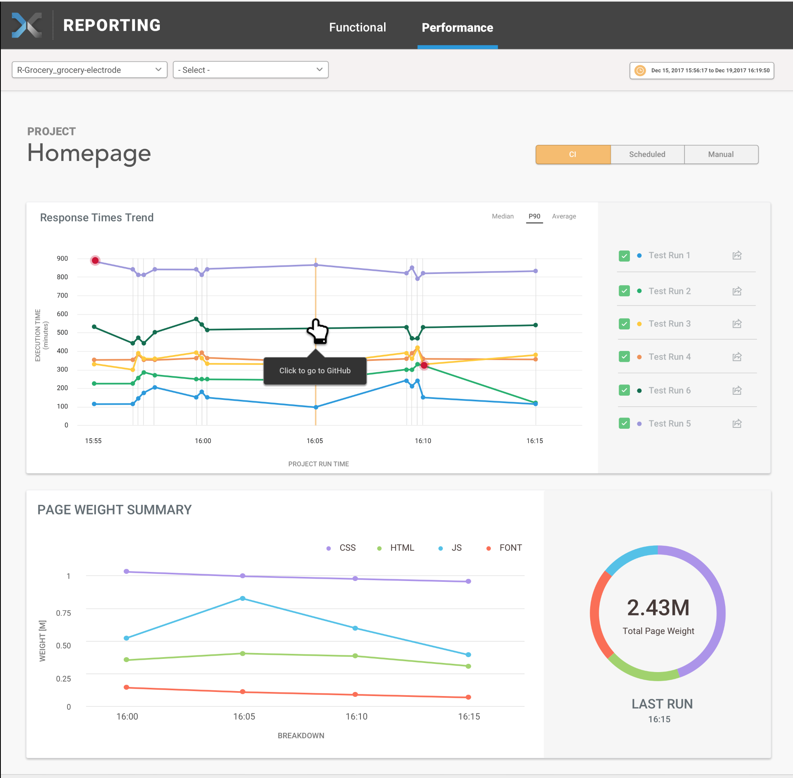
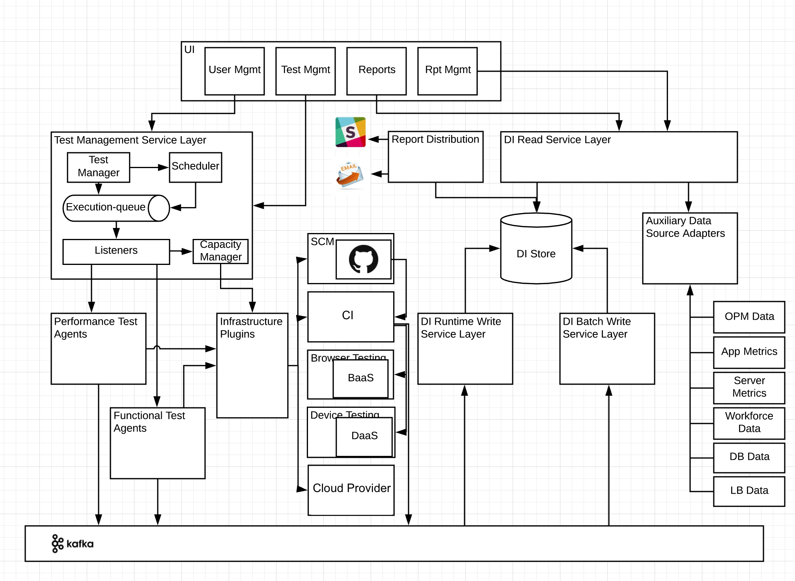

Trending Performance Data Insights allow the developer to see how the performance
of their application has evolved over time.

## Use case

As applications change over time with new code updates and added features, the performance
of the application can be both positively and negatively affected. Easily accessed trending
performance data enables the development team to identify which change introduced an increase
or decrease in the performance of their application, giving crucial information in the
effort to continue improvements to performance, or fix degradations.

## Impact

Performance is one the most impacting factors on the customer experience, and can be very
difficult to diagnose when problems arise. By providing reliable, simple access to the data
from performance testing, the developer benefits from increased knowledge of potential
issues without friction and the customer gets an enhanced experience.

## Dashboard

The Data Insights Platform will provide clear reporting views for your project - see this
preview of the visualization of your data:

## Architecture

