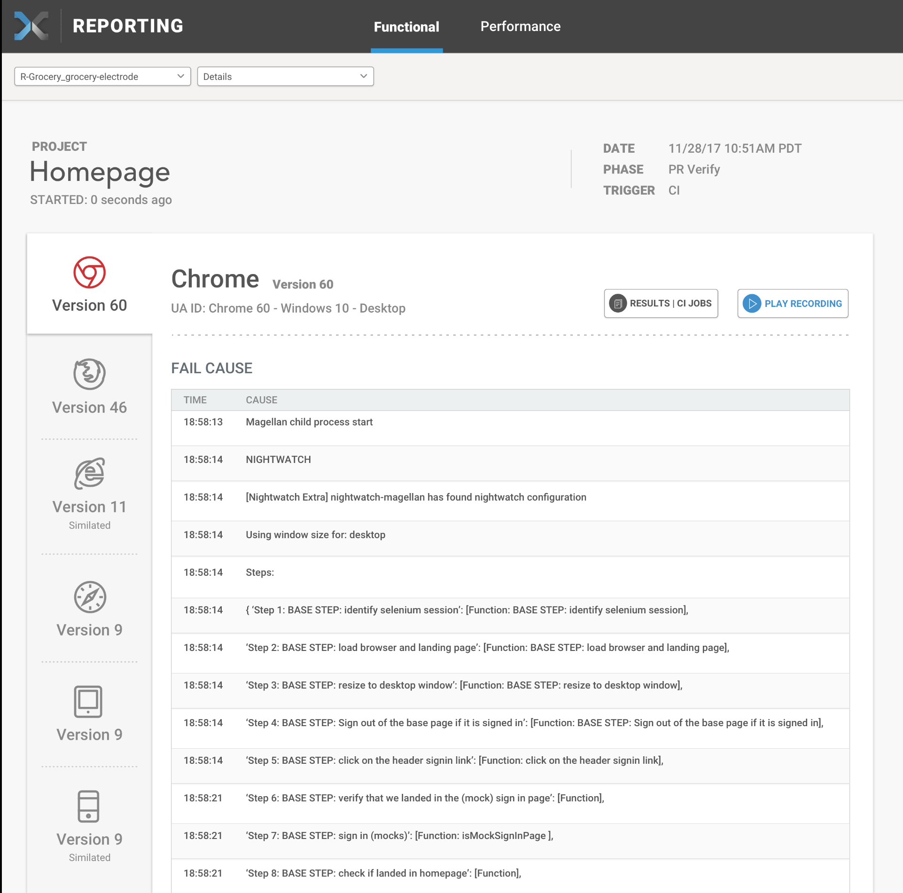

Real-Time Functional Testing Data Insights allow the developer to see results of their
functional testing as they are returned, reducing the time spent waiting for this information.

## Use case

When running functional tests on multiple browsers or devices, the sooner the data is available,
the faster the developer can take action to correct issues.

After configuring and running functional tests, the developer would access the real-time
functional reports to assess the results as they are reported.

## Impact

The less time developers waste waiting for test data to be available, the more productive
those developers are - and the better their workflow is. What results is an improved
experience for developers in the organization, and - through improved application quality
and visual appearance that comes from these insights - a greatly improved experience
for the customer.

## Dashboard

The Data Insights Platform will provide clear reporting views for your project - see this
preview of the visualization of your data:

## Architecture

