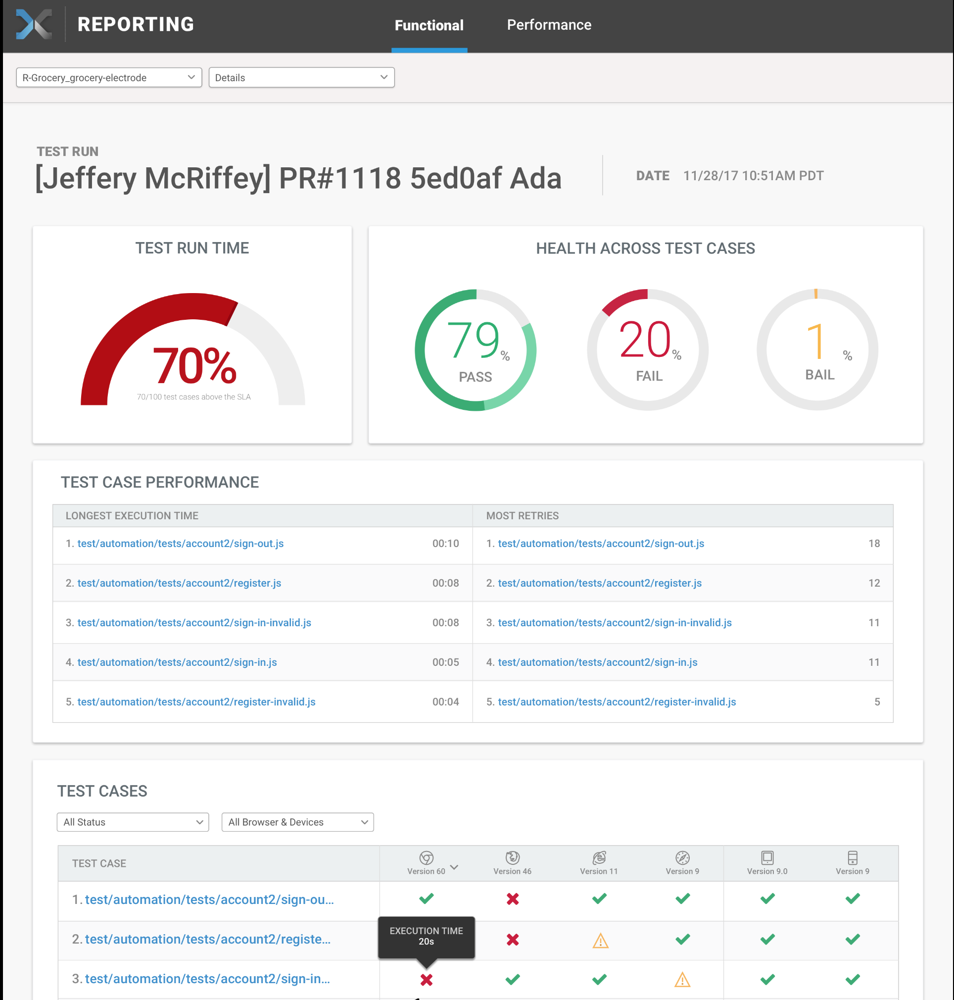
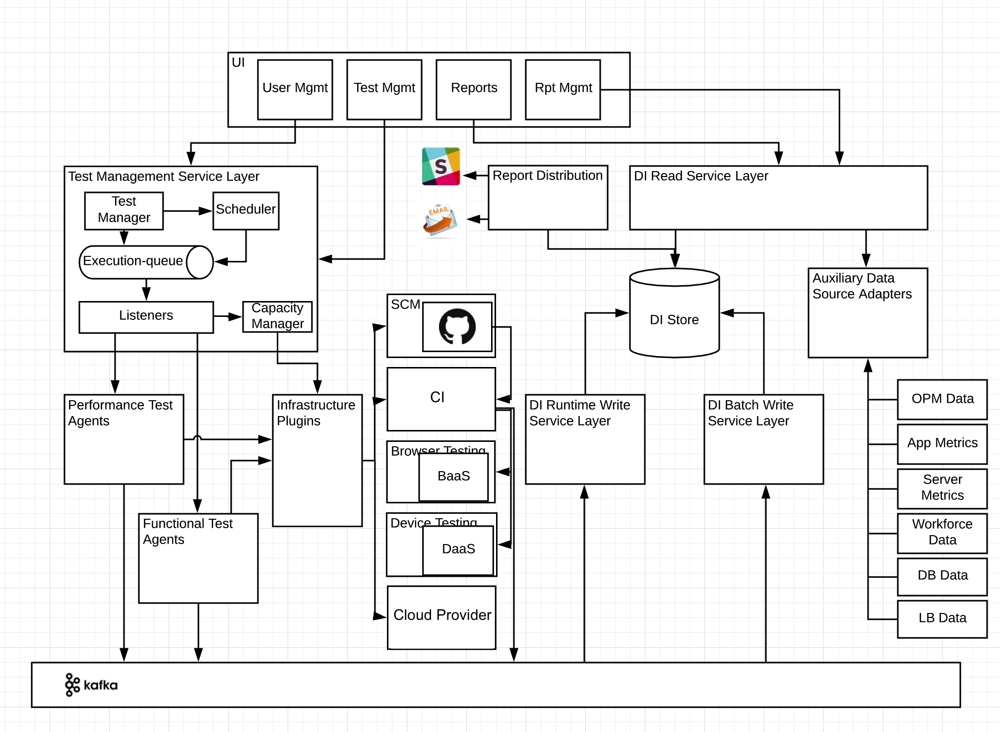

Trending Functional Data Insights allow the developer to see how the health of their
functional test suite has evolved over time.

## Use case

As applications change over time with new code updates and added features, there is the
potential for functionality and appearance to break or unexpectedly change. Easily accessed
trending functional data enables the development team to assess the impact of these changes
on the health of their test suite.

This helps identify repeated issues being introduced, highlight features that are consistently
failing on certain browsers/devices and pinpoint browsers/devices that need special attention
by the development team.

## Impact

Having access to this trending data allows teams to make lasting changes to their development
workflows to avoid repeating the same mistakes. This saves many hours of engineering time over
the life of a project, and improves code quality across the organization.

## Dashboard

The Data Insights Platform will provide clear reporting views for your project - see this
preview of the visualization of your data:

## Architecture

