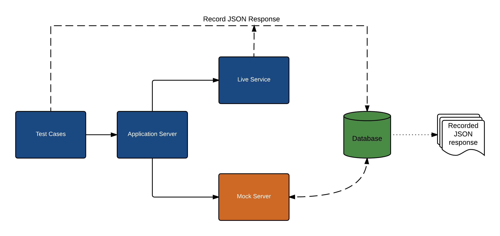

### 1. What is Shifu?

 We provide a mocking solution which can be leveraged to quickly stub the REST API responses that are used by your application during development or testing. The application points to the mock service host address instead of the live service, pre-recorded responses are then returned for various endpoints from the mock service. Since there is minimal logic when writing mock service, maintaining and development cost for mock service is minimal. Some of the major development pain-points addressed by the mocking solution are:
- Unstable services
- Inconsistent Data
- Test against negative or unreal scenarios

### 2. Architectural Explanation

### 3. High Level Key Features

- **UI Interface:** Mock service UI for manual testing/debugging.
- **Test Reuse:** Execute same test cases against mock or live service.
- **Drop-And-Respond:** Respond with a mocked data file based on the url route path automatically by dropping mocked data file in folder mapping to url path.
- **Response Reuse:** Ability to use same json response file and change data dynamically for mocked response for various variants.
- **Test De-coupling:** No coupling with test cases - Test cases are independent of mock implementation except that setting the desired response for the mock service (which has no impact if the test case is run against a live service).
- **Common Utilities:** Common utility methods are provided as part of this solution which allows quicker test development.
- **HTTPS Support:** HTTPS support for all the urls.
- **Magellan/Nightwatch integration:** Ability to use mocking service with Magellan tests.
- **Parallel sessions:** Support for single instance mock server for parallel processes
- **Swagger integration:** Automatic mock creator for web-services with swagger definition.
- **Server states:** Ability to mock server state.

### 4. Mock Terminology

- Routes
- Variants
- Handler
- SetMockId
- Admin UI
- RespondWithFile
