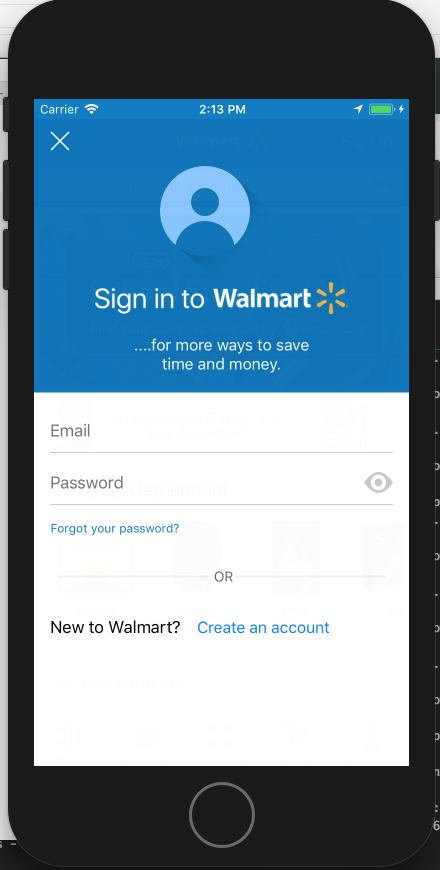
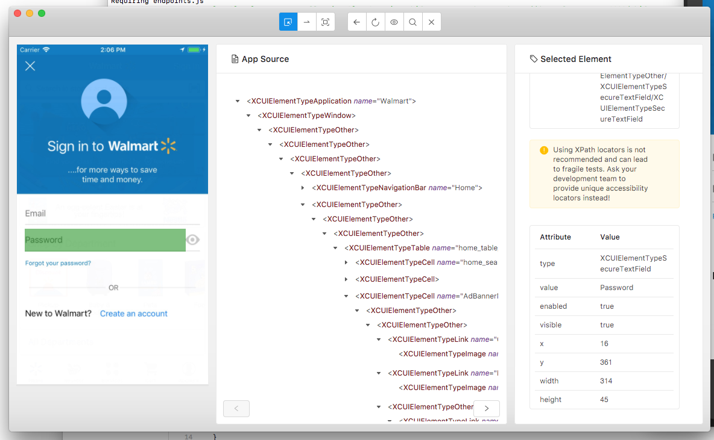

### Native app locators

- To find the native app locators, there is a handy tool:
 **[Appium Desktop](https://github.com/appium/appium-desktop)**  
 - It's a GUI wrapper around the Appium server, comes with an Inspector, which enables you to check out the hierarchy of your app.

- E.g How to find the *Password* locator in Sign in screen



  **Steps:**
   1. Open Appium Desktop, and start the server 
   2. Click **Start Inspector Session** button
   3. Add the Desired Capabilites property one by one. Or Add them from a .json data, e.g.
```bash
{
        "app": "/Users/abc/app/Walmart.app",
        "appiumVersion": "1.7.2",
        "automationName": "XCUITest",
        "platformName": "iOS",
        "platformVersion": "11.2",
        "deviceName": "iPhone 8",
        "waitForAppScript": "true",
        "locationServicesAuthorized": "true",
        "locationServicesEnabled": "true",
        "bundleId": "com.walmart.beta.electronics"
      }
```
   4. Click **Start Session** to start the inspector
   5. Go to the Sign In screen, and select **Password** field in the inspector's left preview window.
 
   6. Check the element's attribute. E.g for this case, it has an unique value `"Password"`, then we can use ***accessibility id*** as the **locateStrategy** and ***Password***, as the **selector**
   7. If the element does not have an unique value, you could locate element by relative **xpath**. e.g. ***//XCUIElementTypeSecureTextField[@value="Password"]***
   8. Please note - should use ***accessibility id*** as much as possible.  ***xpath*** is slow and unreliable.

### Quiz
 - Please find the 'Forgot your password?' locator.
 - Can you make the inspector point to the mocked App? *Hint: You can refer to `processArguments` desired capabilities setup in **nightwatch.json** file, and you need to start a mock server:* 
```bash
node ./resources/run-mock-server-console.js
```
