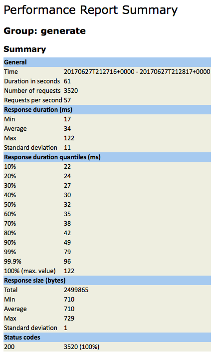
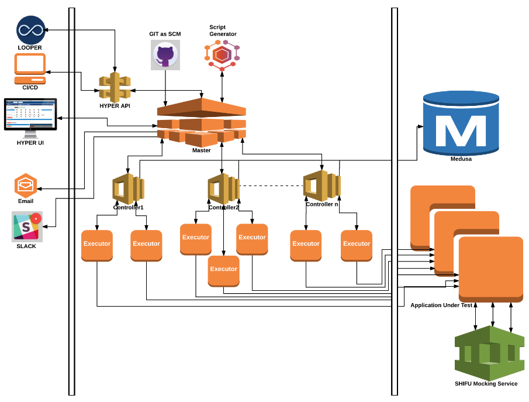

### **Summary**

Our Performance Testing solution, based on JMeter, was developed in-house and built entirely from open source components. It enables engineers to execute performance tests on their own, without any dependencies. The user is able to monitor the test in Real Time, while the test is running, and at the end of the test get the Test Report over email; and it can also be integrated with Slack, to receive the Test Report on the dedicated Slack Channel. It allows engineers to build and modify tests quickly and easily, offering considerable time savings with minimal-to-none outside help.

### **Key Features**

*   Ability to run performance tests without performance engineering team involvement
*   No licensing or other third party costs involved, as the tool is build in-house from open source components
*   Estimated time-savings of 7 hours minimum of combined Performance+DevEngineer time for basic API tests
*   For existing tests, you can modify the API’s endpoint URL, Data Files, Workload Model etc. quickly and, easily
*   Readily observe and identify your project’s performance trends and plan accordingly
*   The Slack integration allows you to post the test reports on the dedicated channel
*   All Stats are in one place; easy to understand your app/api performance at a glance
*   Ability to monitor your test in Real Time, while the test is executing
*   All Infrastructure in on _cloud provider_ and it is easily scalable

### **Use Case**

**Testing a New or Existing API**

A developer wants to track the performance of an API call, a HTTP POST Method Call used to generate a promotional coupon as part of GOP - OneWalmart. They are interested in the following performance characteristics:

*   Response Time
*   Throughput

**Report**

*   Once the test is completed, a similar report will be generated and sent to the email provided during test execution

### **Architecture**

### **Feature List**

**Phase 1**

*   Ability to Execute Independently through the UI
*   One Step Ramp up Model
*   Both HTTP and HTTPS Protocols Available
*   HTTP Methods Available Include both GET and, POST
*   The Ability to Send Header Information as part of the Request
*   Adding Single Column Data Files in CSV Format
*   UI Showing Trend Graphs
*   UI Showing Test Status, whether the Test is Executing or, Queued
*   Slack Integration for Reporting
*   Email Integration for Sending Reports
*   Integration with GIT
*   Data Files, Workload and Use Case Modification

**Phase 2**

*   Multiple Step Ramp up Model
*   Integration with Medusa
*   Able to Hit Custom Port with the Request

### **Planned Features**

*   Run All Use Cases Sequentially at the Project Level
*   Text Validation on the Response
*   Ability to Use Random Variables
*   Ability to Use UUID Variable
*   .perf File Validation
*   VU's Graph on the UI
*   Ability to Stop the Test
*   Adding Wait Time between Requests
*   Enable Transactional or Workflow Model Flows
*   Passing Values between Requests
*   The Ability to Parse Response Data
*   The Ability to Provide a User Specified Slack Channel
