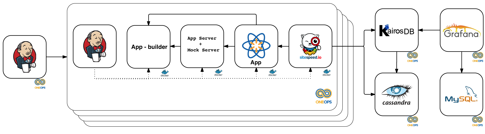

# Summary

As a front end engineer, performance of your application becomes an essential measurement for your application to succeed. With evolving technologies and user-centric apps, it becomes very important to measure performance of your app before it gets released.  This is where our tool can help you to measure the performance of the app at every phase of your release cycles.

## The performance measurement tool

The client side performance measurement tool is based on Sitespeed and is currently serving Web and mWeb interfaces. We have plans to roll out client side performance testing for native apps (android and iOS) soon.

Our test runner is a self-service solution for performance monitoring that could be easily and seamlessly integrated into the software development lifecycle (SDLC).

# Use Cases

This solution will help teams track performance over a matrix of code-bases, configurations, environments, etc.

Here are a few use cases we envision: 

- Trigger performance measurement via command line interface (CLI);
- Trigger performance measurement on pull request (PR);
- Trigger performance measurement after deployment;
- Schedule performance measurement;
- Visualize performance reports;
- Visualize how performance trend by release or over time;
- Define performance budgets that could fail PRs or rollback deployments.

# Impact

Our test runner will empower developers and help them not only to prevent performance regressions but also to experiment and iterate faster, by squeezing every millisecond they can and ensuring their code is not a bottleneck.

It can also help find hot spots and provide insight from application, to page and component levels.

# Architecture

Our test solution will integrate and orchestrate multiple components to measure performance according to many scenarios:

- Application and mocking servers;
- Synthetic users;
- Runtime instrumentation and payload rewriting;
- Network link conditioning.

At a very high level, system architecture:

# Feature list

 - Integrates with your CI pipeline to run performance tests as you merge code in Git repo.
 - Provides reporting in time series data which can be visualized to see the trend of your application in development phase itself.
 - _Laboratory conditions_: the tests run in a very restricted environment so that we can rely on the test results without worrying about the noise that can come from network delays, CPU or memory resources. The environment are carefully monitored for any other latency or resource conflicts that may affect the performance test results.
 - _Framework Independent_:  If your app is a NodeJS app, our tool will seemlessly measure your performance. It does not matter if your app is React, Angular, Vue or any other framework.
 - _Local Execution_ : a local version can be used to run tests on your development machine before you check in code. 
- _Mock Server Integration_ : Tests can be run with a mock server to provide a noise-free testing.  This is an optional feature.  You can remove the mock server if you need to do live server testing, eg. production or stage testing.
 - Runs for Chrome and Firefox browsers.

## Metrics collected

Our performance tool collects metrics from the browser API via [sitespeed.io](https://www.sitespeed.io). Most of the browsers have a performance API which can be used to capture the performance measurements of an app. Sitespeed.io captures these metrics and provides a metric data which is then transformed into a readable data. 

**Navigation API:**
- responseTime (TTFB)
- backendTime
- frontendTime
- redirectionTime
- dnsLookUpTime
- serverConnection
- serverResponse
- firstPaint
- rumSpeedIndex
- domContentLoadEventStart
- domContentLoadEventEnd
- domInteractive
- pageLoad
- fullyLoaded

**Assets:**

- Html content size
- Image content size
- Javascript content size
- Font content size
- CSS content size
- SVG content size
- Cookie size
- Total Header size
- Total content transfer size

**Custom metrics:** (These are added by the app teams on their pages, few examples are below)

- aboveTheFold
- beforeBundle
- afterBundle
- index_start
- first_script
- entrypoint
- load

**HTTP status codes:** 
- Number of 404 response codes
- Number of 200 response codes

**Other metrics:**
- number of domains
- last modified stats

## Planned features

- mweb support
- native support
