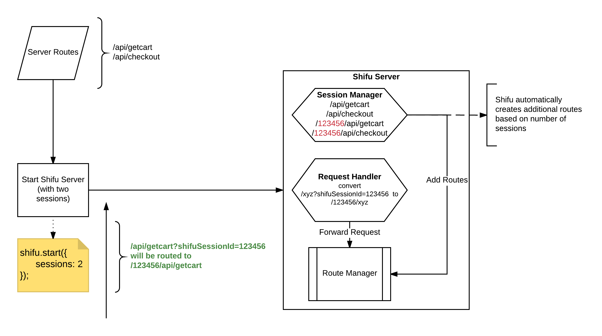

### 1. What is parallel sessions and why it's needed?

Parallel sessions allows you to run multiple instance of server virtually while running only one server. This is helpful when you are running multiple test cases which access the same routes but different variants as parallel sessions allow you to set different variants on same routes without conflicting. This saves CPU and RAM both as only one server is running instead of multiple. 

### 2. How Parallel Sessions works internally?



### 3. How to add parallel sessions?

> To add parallel sessions, modify run-mock-server-console.js to add 'sessions' parameter. 

```js
require('./endpoints');
var shifu = require('shifu');
shifu.start({
  host: "localhost",
  mockedDirectory: "./resources/mocked-data",
  port: 8000,
  sessions: 2,
  project: 'HelloShifu'
});
```
**You can also start or add sessions via command line argument**
``` bash
node resources/run-mock-server-console.js --shifuSessions 2
```

>  If you pass sessions = 2, there will be two parallel sessions along with one default session.

### 4. Supported APIs for Parallel sessions

1. Register Session
    To register sessions to be used 
    ```js
    var sessionId = shifu.registerSession();
    ```

1. Get Sessions 
    To get all the active sessions 
    ```js
    var activeSessions = shifu.getSessions();
    ```

1. Check Session
    To check the session status (Available or In-Use or invalid) 
    ```js
    var sessionStatus = shifu.checkSession(sessionId);
    ```

1. Close Session
    To de-register session for later use 
    ```js
    var closeSession = shifu.closeSession(sessionId);
    ```

### 5. Using Parallel Sessions

To use a parallel session call the following api: 
```bash
curl http://localhost:8000/_admin/api/shifu/registerSession
```
or 
```js
shifu.registerSession()
```
and a session id will be returned.

Append this sessionId to the mocked host address to use this parallel session. For ex: If your mock host server is http://localhost:8080 and your session id is `112233` then the mock server address for this parallel session will be http://localhost:8080/112233.

### 6. Verifying parallel sessions

Start mock server with two sessions. Now go to the 'Message' route. You will see three routes for message, default and two for parallel sessions that you just added. Now for each route choose a different variant and hit the URL icon. You will see that each time you will get a different value though you are hitting the same route. 

### 7. Understanding the Shifu UI with sessions

Try to go through Shifu UI to understand sessions.